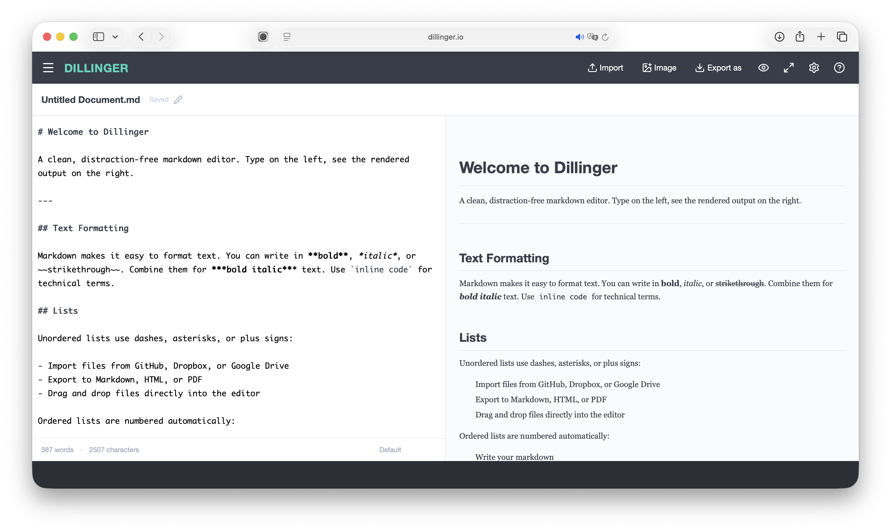
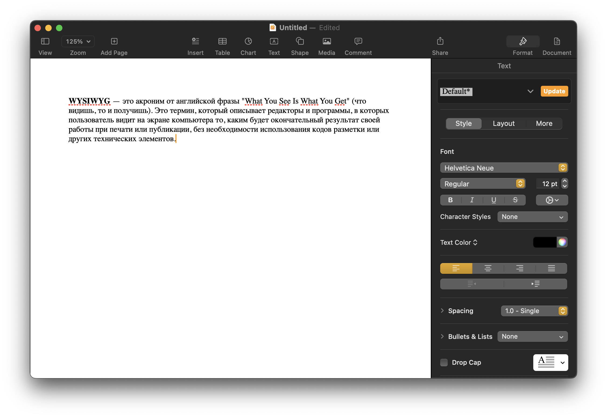

## Что такое Markdown?

**Markdown** — это легкий язык разметки, который позволяет добавлять элементы форматирования к обычному тексту. Созданный **Джоном Грубером (John Gruber)** в сотрудничестве с **Аароном Шварцем (Aaron Swartz)** в 2004 году, **Markdown** теперь является одним из самых популярных языков разметки в мире.

Отличие использования **Markdown** от **WYSIWYG**\-редакторов, таких как **Microsoft Word (Windows)** или **Pages (macOS)**, заключается в том, что в **Markdown** вы добавляете специальный синтаксис к тексту, указывая, какие части текста должны выглядеть иначе.

Например, чтобы создать заголовок, добавляется символ номера перед текстом (например, `# Заголовок первого уровня`).

Чтобы сделать фразу жирной, необходимо добавить две звездочки до и после нее (например, `**этот текст выделен жирным**`).

Привыкнуть к синтаксису **Markdown** может потребовать времени, особенно если вы привыкли к редакторам **WYSIWYG**. 

**WYSIWYG** — это акроним от английской фразы "What You See Is What You Get" (что видишь, то и получишь). Это термин, который описывает редакторы и программы, в которых пользователь видит на экране компьютера то, каким будет окончательный результат своей работы при печати или публикации, без необходимости использования кодов разметки или других технических элементов.

Принцип работы **WYSIWYG** заключается в том, что пользователь визуально форматирует документ, используя интерфейс программы, а программа автоматически генерирует соответствующий код или разметку. Это делает процесс создания содержания более доступным для людей, не обладающих глубокими знаниями программирования или разметки.

Примерами **WYSIWYG**\-редакторов являются **Microsoft Word**, **Google Docs**, **Pages**, и многие другие текстовые и графические редакторы. В таких приложениях пользователи могут выделять текст, изменять шрифт, размер и цвет символов, вставлять изображения и таблицы, применять стили, и все изменения видны непосредственно в режиме реального времени, без необходимости ввода кода.

В сравнении с **WYSIWYG**, язык разметки, такой как **Markdown**, требует вручную добавлять символы и синтаксис для форматирования текста. В обмен на некоторую степень "ручного" управления, **Markdown** обеспечивает более легкий и чистый код, что может быть полезно при создании текстового контента для веб-сайтов и других цифровых платформ.

Элементы форматирования **Markdown** можно добавлять в обычный текстовый файл, используя текстовый редактор, или использовать одно из многочисленных приложений **Markdown** для различных операционных систем. Существуют также веб-приложения, специально предназначенные для написания в **Markdown**.

В зависимости от приложения предварительный просмотр отформатированного документа может быть недоступен в реальном времени, но это не является проблемой. Синтаксис **Markdown** разработан так, чтобы текст в файлах оставался читаемым и без форматирования.

Главная цель форматирования в **Markdown** — сделать текст максимально читаемым. Идея заключается в том, что документ в формате **Markdown** можно опубликовать в виде обычного текста, без заметных следов разметки или форматирования.