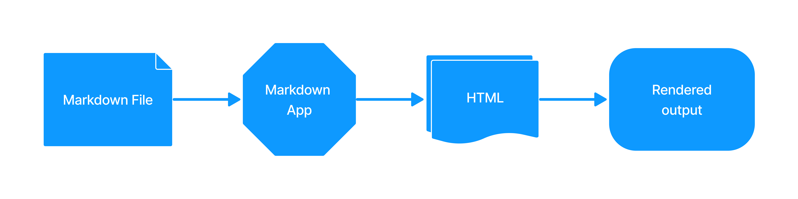

## Как работает Markdown?

При написании в **Markdown**, текст сохраняется в файле обычного текста с расширением `.md` или `.markdown`. Но что происходит дальше? Как ваш файл в формате Markdown превращается в **HTML** или подготавливается к печати?

Вам нужно приложение процессор **Markdown**, способное обрабатывать файл **Markdown**. Существует множество таких приложений — от простых сценариев до настольных приложений, напоминающих Microsoft Word. Несмотря на визуальные различия, все эти приложения выполняют одну и ту же функцию. Как и **Dillinger**, они преобразуют текст в формате **Markdown** в **HTML**, чтобы его можно было отображать в веб-браузерах.

Приложения **Markdown** используют так называемый процессор **Markdown** (также часто называемый "парсером" или "реализацией"), чтобы взять текст в формате **Markdown** и преобразовать его в формат **HTML**. На этом этапе ваш документ можно просматривать в веб-браузере или объединять с таблицей стилей и печатать. Ниже вы можете увидеть схему этого процесса.

Приложение и процессор **Markdown** — это два отдельных компонента. 

В целях краткости, на схеме ниже я объединил их в один элемент "**Приложение Markdown**":

С вашей точки зрения процесс будет немного различаться в зависимости от приложения, которое вы используете.

Например, **Dillinger** фактически объединяет шаги 1-3 в единый, безшовный интерфейс — всё, что вам нужно сделать, это печатать в левой панели, и отформатированный вывод волшебным образом появляется в правой панели. Однако, если вы используете другие инструменты, такие как текстовый редактор с генератором статических сайтов, вы увидите, что этот процесс более заметен. 