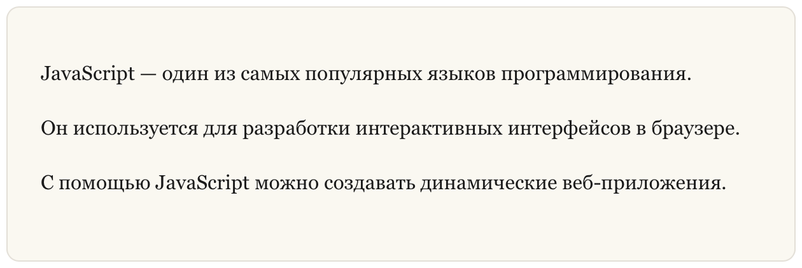
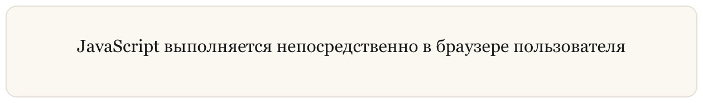
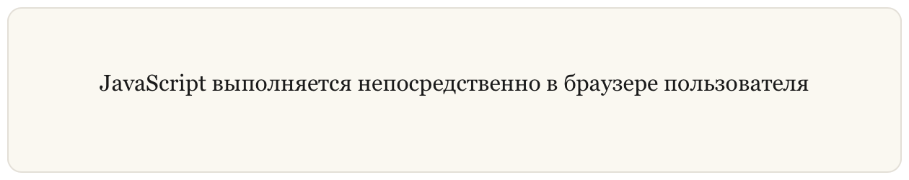

## Параграфы

В **Markdown** параграфы (**Paragraphs**) создаются с помощью **пустой строки**, которая отделяет один блок текста от другого.

Такой способ используется во всей технической документации: README-файлах, статьях, инструкциях и учебных материалах по программированию.

### Создание параграфов

**Пример (Markdown):**

```markdown
JavaScript — один из самых популярных языков программирования.

Он используется для разработки интерактивных интерфейсов в браузере.

С помощью JavaScript можно создавать динамические веб-приложения.
```

**Результат (HTML):**

```html
<p>JavaScript — один из самых популярных языков программирования.</p>
<p>Он используется для разработки интерактивных интерфейсов в браузере.</p>
<p>С помощью JavaScript можно создавать динамические веб-приложения.</p>
```

**Результат (Отображение):**



### Полезные советы

-   Не добавляйте табуляцию или пробелы в начале строки при создании параграфов. В Markdown это может изменить интерпретацию текста.
-   Если вам нужно сделать визуальный отступ перед текстом, можно использовать `&nbsp;` — неразрывный пробел (_Non-breaking space_).  
      
    **Пример (Markdown):**
    ```markdown
    &nbsp;&nbsp;&nbsp;&nbsp;JavaScript выполняется в браузере пользователя.
    ```
    **Результат (HTML):**
    ```html
    <p>&nbsp;&nbsp;&nbsp;&nbsp;JavaScript выполняется в браузере пользователя.</p>
    ```
    **Результат (Отображение):**
    
        
    
-   Старайтесь писать строки с выравниванием по левому краю. Это делает Markdown-документ более читаемым и удобным для редактирования.

### Выравнивание текста по центру

В стандартном **Markdown** нет встроенной возможности выравнивания текста. Однако многие Markdown-процессоры позволяют использовать **HTML внутри Markdown**.

Например, можно использовать HTML-тег `<center>`.

**Пример (Markdown):**

```markdown
<center>JavaScript выполняется непосредственно в браузере пользователя</center>
```

**Результат (HTML):**

```html
<center>JavaScript выполняется непосредственно в браузере пользователя</center>
```

**Результат (Отображение):**



**Важно:** HTML-тег `<center>` считается **устаревшим**. Он всё ещё поддерживается браузерами, но в современных проектах рекомендуется использовать CSS.

Если Markdown-процессор поддерживает **встроенные стили (Inline Styles)**, можно использовать следующий вариант:

**Пример (Markdown):**

```markdown
<p style="text-align:center">JavaScript выполняется непосредственно в браузере пользователя</p>
```

**Результат (HTML):**

```html
<p style="text-align:center">JavaScript выполняется непосредственно в браузере пользователя</p>
```

**Результат (Отображение):**

