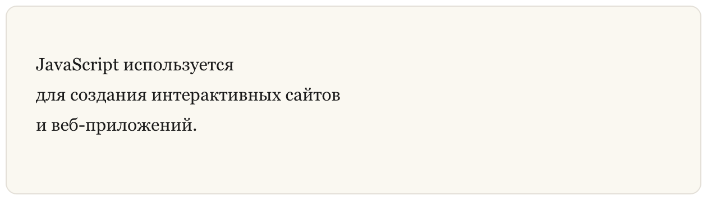

## Переносы строк

В **Markdown** **перенос строки (Line Breaks)** работает немного иначе, чем в обычных текстовых редакторах. В этом уроке мы рассмотрим, как правильно использовать переносы строк для форматирования текста.

Переносы строк часто используются в документации, учебных материалах и технических статьях, например при описании кода или объяснении алгоритмов.

### Добавление переноса строк

Чтобы добавить простой перенос строки (без создания нового абзаца), в конце строки вставьте **два пробела**, а затем выполните перевод строки.

**Пример (Markdown):**

```markdown
JavaScript используется  
для создания интерактивных сайтов  
и веб-приложений.
```

**Результат (HTML):**

```html
<p>JavaScript используется<br>для создания интерактивных сайтов<br>и веб-приложений.</p>
```

**Результат (Отображение):**



### Перенос строки с использованием HTML

Если ваше приложение для работы с **Markdown** поддерживает **HTML**, можно использовать тег `<br>` для создания переноса строки внутри абзаца.

Этот способ часто используется в документации или учебных материалах, когда нужно контролировать точное расположение текста.

**Пример (Markdown):**

```markdown
JavaScript используется<br>
для создания интерактивных сайтов<br>
и веб-приложений.
```

**Результат (HTML):**

```html
<p>JavaScript используется<br>для создания интерактивных сайтов<br>и веб-приложений.</p>
```

**Результат (Отображение):**


Переносы строк помогают сделать текст более удобным для чтения. Например, их можно использовать для:

-   пошаговых инструкций
-   описания алгоритмов
-   объяснения примеров кода
-   структурирования технической документации

Правильное использование переносов строк делает материал более понятным и аккуратно оформленным.