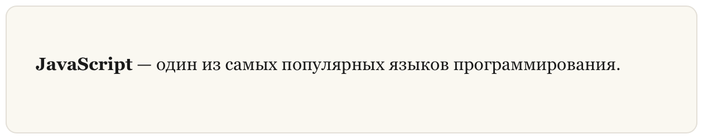
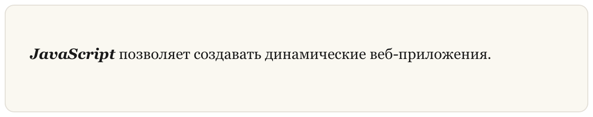
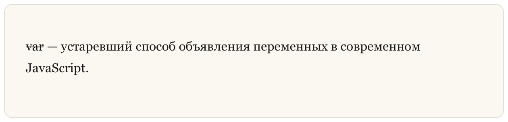
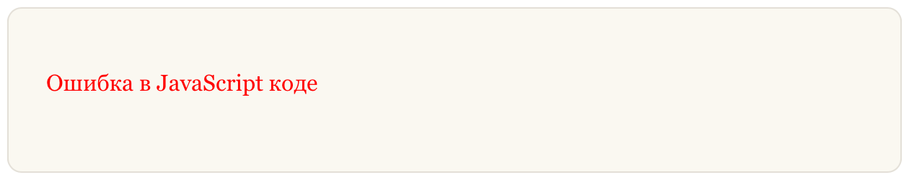

## Акценты

В **Markdown** можно добавлять **акценты (Emphasis)**, чтобы выделить важные части текста.

Акценты помогают обратить внимание читателя на ключевые понятия, важные термины или предупреждения в документации, учебных материалах и технических статьях.

### Жирный текст

Чтобы сделать текст **жирным (Bold)**, используйте две звездочки `**` или два подчеркивания `__` вокруг текста.

**Пример (Markdown):**

```markdown
**JavaScript** — один из самых популярных языков программирования.
```

**Результат (HTML):**

```html
<strong>JavaScript</strong> — один из самых популярных языков программирования.
```

**Результат (Отображение):**



### Курсив

Чтобы сделать текст **курсивным (Italic)**, используйте одну звездочку `*` или одно подчеркивание `_` вокруг текста.

**Пример (Markdown):**

```markdown
*JavaScript* используется для создания интерактивных веб-страниц.
```

**Результат (HTML):**

```html
<em>JavaScript</em> используется для создания интерактивных веб-страниц.
```

**Результат (Отображение):**



### Жирный и курсив

Для комбинированного эффекта **жирного и курсивного текста (Bold and Italic)** используйте три звездочки `***` или три подчеркивания `___`.

**Пример (Markdown):**

```markdown
***JavaScript*** позволяет создавать динамические веб-приложения.
```

**Результат (HTML):**

```html
<strong><em>JavaScript</em></strong> позволяет создавать динамические веб-приложения.
```

**Результат (Отображение):**


### Зачеркнутый текст

Чтобы добавить **зачеркивание (Strikethrough)**, используйте две тильды `~~` вокруг текста.

Это может быть полезно, например, чтобы показать устаревшую информацию.

**Пример (Markdown):**

```markdown
~~var~~ — устаревший способ объявления переменных в современном JavaScript.
```

**Результат (HTML):**

```html
<s>var</s> — устаревший способ объявления переменных в современном JavaScript.
```

**Результат (Отображение):**



### Цветной текст

**Markdown** не позволяет изменять цвет текста напрямую. Однако если ваш процессор **Markdown** поддерживает **HTML**, вы можете использовать HTML-теги.

Например, можно использовать тег `<font>`.

**Пример (Markdown):**

```markdown
<font color="red">Ошибка в JavaScript коде</font>
```

**Результат (HTML):**

```html
<font color="red">Ошибка в JavaScript коде</font>
```

**Результат (Отображение):**


Тег `<font>` официально считается устаревшим. Поэтому чаще используют **встроенные стили (Inline Styles)**.

**Пример (Markdown):**

```markdown
<span style="color:red">Ошибка в JavaScript коде</span>
```

**Результат (HTML):**

```html
<span style="color:red">Ошибка в JavaScript коде</span>
```

**Результат (Отображение):**



Акценты помогают сделать текст более понятным и структурированным. Например, в технической документации или учебных курсах можно выделять:

-   ключевые термины
-   названия технологий
-   важные предупреждения
-   новые понятия

Это делает учебные материалы более удобными для чтения и понимания.