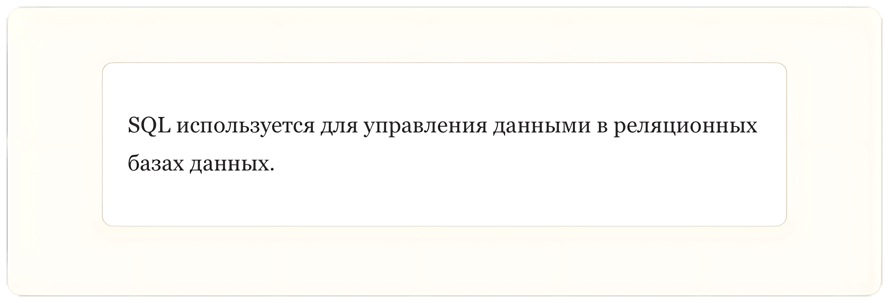
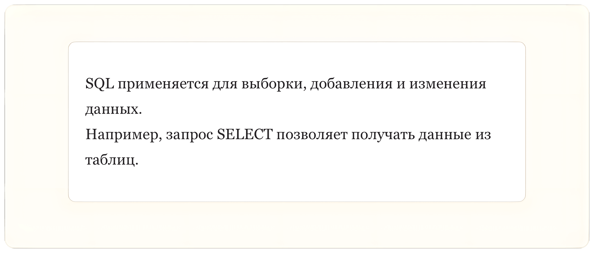
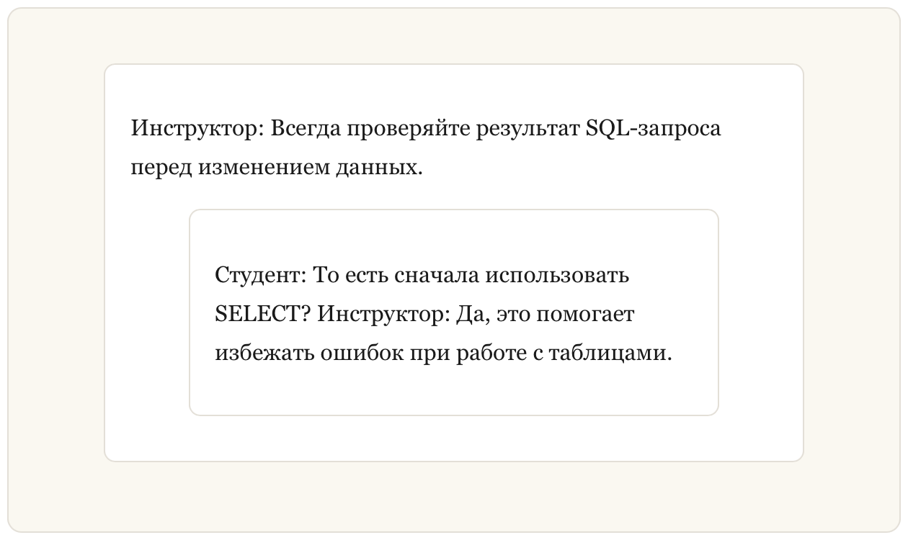
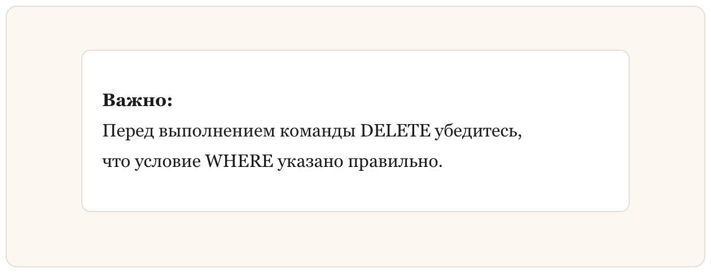

## Блок цитат

**Блок цитат (Blockquote)** в **Markdown** позволяет выделить текст и оформить его как цитату.

В технической документации такие блоки часто используются для выделения **важных замечаний, советов или пояснений**, например при изучении **SQL** и работе с базами данных.

### Простой блок цитат

Для создания блока цитаты используйте символ большой стрелки `>` перед текстом.

**Пример (Markdown):**

```markdown
> SQL используется для управления данными в реляционных базах данных.
```

**Результат (HTML):**

```html
<blockquote>SQL используется для управления данными в реляционных базах данных.</blockquote>
```

**Результат (Отображение):**



### Блок цитат с несколькими абзацами

Блок цитаты может содержать несколько строк текста.

**Пример (Markdown):**

```markdown
> SQL применяется для выборки, добавления и изменения данных.  
> Например, запрос SELECT позволяет получать данные из таблиц.
```

**Результат (HTML):**

```html
<blockquote>SQL применяется для выборки, добавления и изменения данных.<br>Например, запрос SELECT позволяет получать данные из таблиц.</blockquote>
```

**Результат (Отображение):**



### Вложенные блоки цитат

Блоки цитат могут быть вложенными. Для этого используется несколько символов `>`.

**Пример (Markdown):**

```markdown
> Инструктор: Всегда проверяйте результат SQL-запроса перед изменением данных.
>> Студент: То есть сначала использовать SELECT?
>> Инструктор: Да, это помогает избежать ошибок при работе с таблицами.
```

**Результат (HTML):**

```html
<blockquote>
  <p>Инструктор: Всегда проверяйте результат SQL-запроса перед изменением данных.</p>
  <blockquote>
    <p>Студент: То есть сначала использовать SELECT?<br>Инструктор: Да, это помогает избежать ошибок при работе с таблицами.</p>
  </blockquote>
</blockquote>
```

**Результат (Отображение):**



### Блоки цитат с другими элементами

Внутри блока цитаты можно использовать другие элементы **Markdown**, например **жирный текст** или **курсив**.

**Пример (Markdown):**

```markdown
> **Важно:**  
> Перед выполнением команды DELETE убедитесь,  
> что условие WHERE указано правильно.
```

**Результат (HTML):**

```html
<blockquote>
  <p><strong>Важно:</strong><br>
  Перед выполнением команды DELETE убедитесь,<br>
  что условие WHERE указано правильно.</p>
</blockquote>
```

**Результат (Отображение):**

