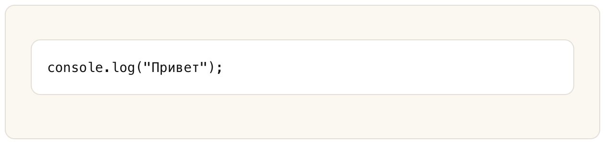
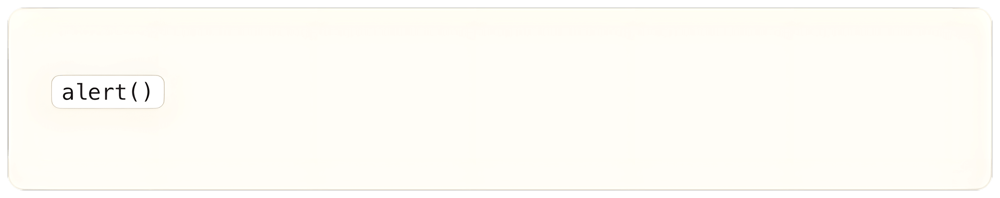
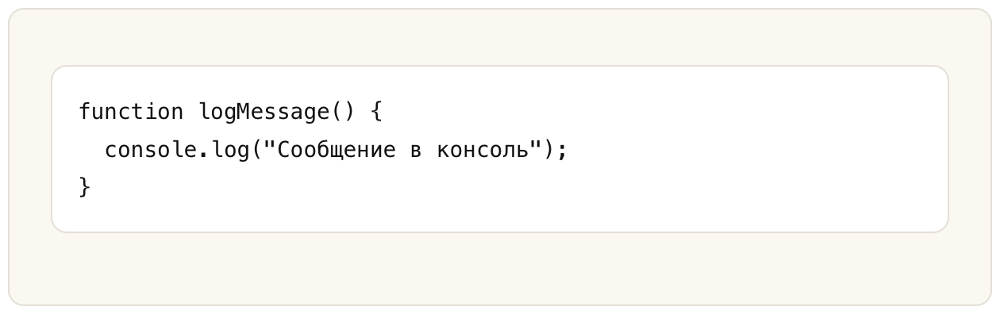
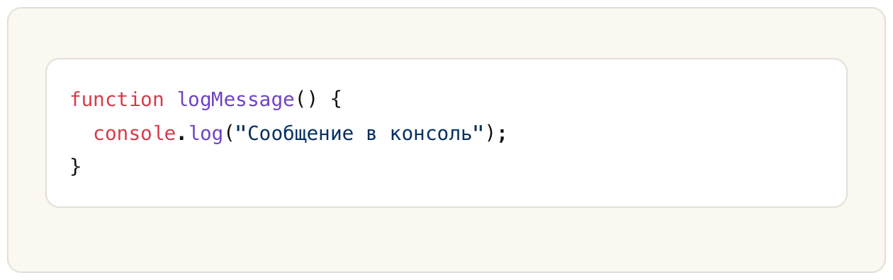

## Код

Вставка **кода (Code)** в **Markdown** позволяет выделить программный код, команды, или другие фрагменты кода для лучшего восприятия и форматирования.

### Вставка Кода

Для вставки кода в текст используются **обратные кавычки (backticks)**.

Обратите внимание, что на клавиатуре это символ, обычно находящийся под **Esc**.

**Пример (Markdown):** 

````markdown
```
console.log("Привет");
```
````

**Результат (HTML):** 

```html
<pre>
  <code>
    console.log("Привет");
  </code>
</pre>
```

**Результат (Отображение):**



### Встроенный Код

В тексте можно вставлять короткие фрагменты кода, обрамляя их одной обратной кавычкой.

**Пример (Markdown):** 

````markdown
`alert()`
````

**Результат (HTML):** 

```html
<code>alert()</code>
```

**Результат (Отображение):**



### Блоки Кода

Если кода много, используйте три обратные кавычки для создания блока кода.

**Пример (Markdown):** 

````markdown
```
function logMessage() {
  console.log("Сообщение в консоль");
}
```
````

**Результат (HTML):** 

```html
<pre>
  <code>
  function logMessage() {
    console.log("Сообщение в консоль");
  }
  </code>
</pre>
```

**Результат (Отображение):**



### Спецификация Языка

Чтобы подсветить код для конкретного языка, добавьте имя языка после трех обратных кавычек.

Обратите внимание, что подсветка языка может не поддерживаться во всех платформах. В таких случаях код будет отображаться без выделения, но сама структура блока кода сохранится.

 **Пример (Markdown):** 

````markdown
```javascript
function logMessage() {
  console.log("Сообщение в консоль");
}
```
````

**Результат (HTML):** 

```html
<pre>
  <code class="language-javascript">
  function logMessage() {
    console.log("Сообщение в консоль");
  }
  </code>
</pre>
```

**Результат (Отображение):**



Основные идентификаторы языков для подсветки кода:

| Язык       | Идентификатор   |
| ---------- | --------------- |
| JavaScript | javascript, js  |
| Python     | python, py      |
| Java       | java            |
| C++        | cpp, c++        |
| C#         | csharp, cs      |
| Go         | go              |
| Rust       | rust, rs        |
| TypeScript | typescript, ts  |
| PHP        | php             |
| Ruby       | ruby, rb        |
| SQL        | sql             |
| HTML       | html            |
| CSS        | css             |
| XML        | xml             |
| YAML       | yaml, yml       |
| Markdown   | markdown, md    |
| Bash       | bash, sh        |
| PowerShell | powershell, ps1 |
| Dockerfile | dockerfile      |