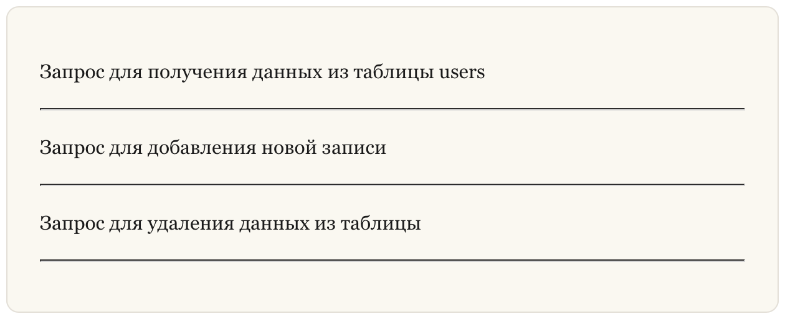

## Горизонтальные линии

**Горизонтальные линии (Horizontal Rules)** в **Markdown** используются для визуального разделения частей документа.

В технической документации и учебных материалах, горизонтальные линии помогают разделять разделы.

### Создание горизонтальных линий

Чтобы создать горизонтальную линию, используйте три дефиса `---`, три подчеркивания `___` или три звездочки `***`.

**Пример (Markdown):**

```no-highlight
Запрос для получения данных из таблицы users

---

Запрос для добавления новой записи

***

Запрос для удаления данных из таблицы

___
```

**Результат (HTML):**

```html
<p>Запрос для получения данных из таблицы users</p>
<hr>
<p>Запрос для добавления новой записи</p>
<hr>
<p>Запрос для удаления данных из таблицы</p>
<hr>

```

**Результат (Отображение):**

