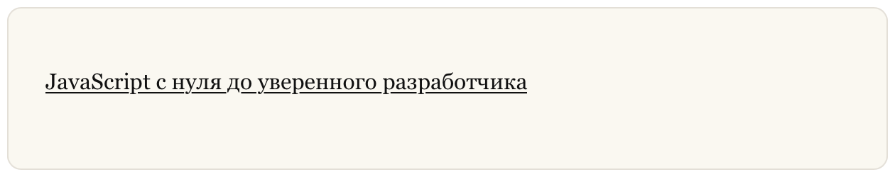
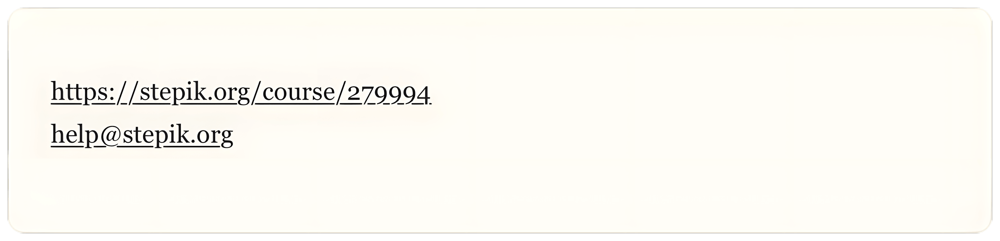

## Ссылки

**Ссылки (Links)** в **Markdown** позволяют вставлять гиперссылки для перехода к другим веб-ресурсам или документам.

В **Markdown** существует несколько способов создания ссылок, а также дополнительные возможности форматирования, которые могут сделать их более выразительными.

### Основы создания ссылок

Создание ссылок осуществляется с использованием квадратных скобок для отображения текста ссылки и круглых скобок для указания самой ссылки.

**Пример (Markdown):** 

```markdown
[JavaScript с нуля до уверенного разработчика](https://stepik.org/course/271057)
```

**Результат (HTML):** 

```html
<a href="https://stepik.org/course/271057">JavaScript с нуля до уверенного разработчика</a>
```

**Результат (Отображение):**



### Ссылки с заголовками (Titles)

Вы можете добавить заголовок для ссылки, который появится в виде подсказки, когда пользователь наводит курсор на ссылку. Для этого заключите заголовок в кавычки после URL.

**Пример (Markdown):** 

```markdown
[JavaScript с нуля до уверенного разработчика](https://stepik.org/course/271057 "Последовательная образовательная траектория по изучению JavaScript с нуля до уверенного уровня. Вы получите прочный фундамент языка: теорию, практику, тренажёры и тесты, необходимые для понимания JavaScript, решения реальных задач и подготовки к техническим собеседованиям.")
```

**Результат (HTML):** 

```html
<a title="Последовательная образовательная траектория по изучению JavaScript с нуля до уверенного уровня. Вы получите прочный фундамент языка: теорию, практику, тренажёры и тесты, необходимые для понимания JavaScript, решения реальных задач и подготовки к техническим собеседованиям." href="https://stepik.org/course/271057">JavaScript с нуля до уверенного разработчика</a>
```

**Результат (Отображение):**


### Форматирование ссылок

Чтобы выделить или изменить стиль текста внутри ссылки, используйте звездочки или подчеркивания.

**Пример (Markdown):** 

```markdown
Мне нравится курс **[SQL с нуля до _практики_](https://stepik.org/course/279994)**.
```

**Результат (HTML):** 

```html
Мне нравится курс <strong><a href="https://stepik.org/course/279994">SQL c нуля до <em>практики</em></a></strong>.
```

**Результат (Отображение):**


### Ссылки на URL и Email

Чтобы быстро создать ссылку на URL или адрес электронной почты, заключите их в угловые скобки.

**Пример (Markdown):** 

```markdown
<https://stepik.org/course/274179>
<help@stepik.org>
```

**Результат (HTML):** 

```html
<a href="https://stepik.org/course/274179">https://stepik.org/course/274179</a>
<a href="mailto:help@stepik.org">help@stepik.org</a>
```

**Результат (Отображение):**

