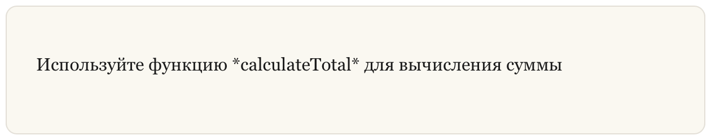
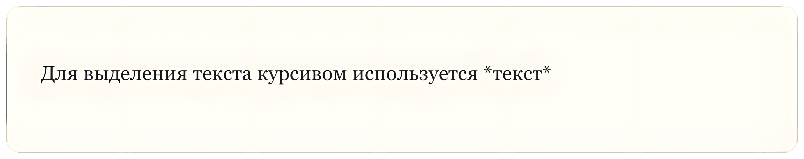

## Экранирующие символы

В **Markdown** иногда нужно показать символы, которые обычно используются для форматирования текста. Например, звездочку `*`, подчеркивание `_` или решетку `#`.

Чтобы такие символы отображались как обычный текст, используется **экранирование (escaping characters)**. Для этого перед символом ставится обратный слеш `\`.

Это особенно полезно при написании **технической документации, README файлов, инструкций и учебных материалов**.

### Пример экранирования

Представьте, что вы пишете документацию и хотите показать строку с символами форматирования.

**Пример (Markdown):**

```markdown
Используйте функцию \*calculateTotal\* для вычисления суммы
```

**Результат (HTML):**

```html
Используйте функцию *calculateTotal* для вычисления суммы
```

**Результат (Отображение):**



### Пример из документации Markdown

Допустим, вы пишете инструкцию по Markdown и хотите показать пользователям, как используется форматирование с помощью звездочек `*`.

Если написать текст без экранирования, Markdown применит форматирование. Чтобы показать сами символы, их нужно экранировать.

**Пример (Markdown):**

```markdown
Для выделения текста курсивом используется \*текст\*
```

**Результат (Отображение):**



### Символы, которые можно экранировать

Вы можете использовать обратный слеш для экранирования следующих символов.

| Символ | Название                                |
| ------ | --------------------------------------- |
| \      | обратный слеш (backslash)               |
| `      | обратная кавычка (backtick)             |
| *      | звездочка (asterisk)                    |
| _      | подчеркивание (underscore)              |
| { }    | фигурные скобки (curly braces)          |
| [ ]    | квадратные скобки (brackets)            |
| < >    | угловые скобки (angle brackets)         |
| ( )    | круглые скобки (parentheses)            |
| #      | знак номера (pound sign)                |
| +      | плюс (plus sign)                        |
| -      | минус (minus sign, hyphen)              |
| .      | точка (dot)                             |
| !      | восклицательный знак (exclamation mark) |
| \|     | вертикальная черта (pipe)               |

Экранирование часто используется при написании **README файлов, документации к JavaScript-библиотекам и учебных материалов**, когда необходимо показать специальные символы без применения форматирования.