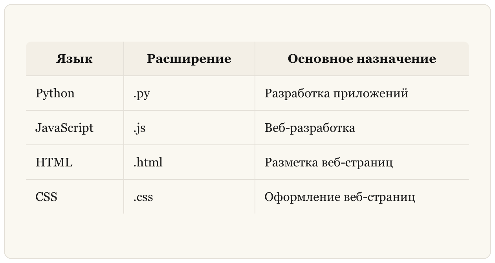
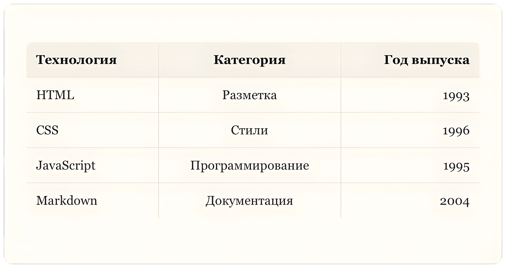
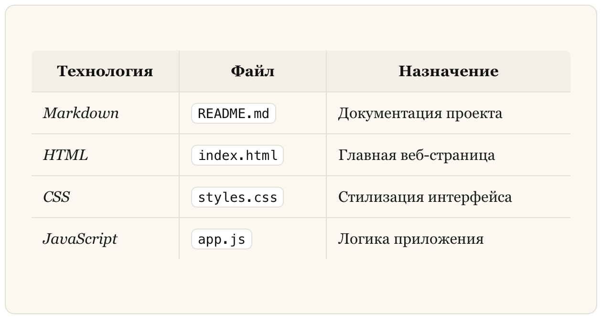
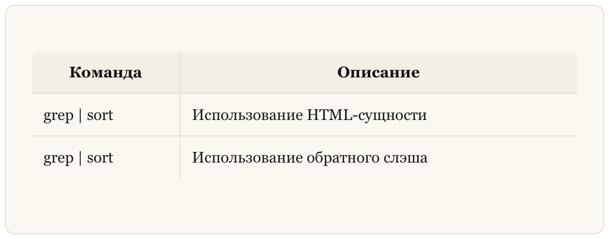
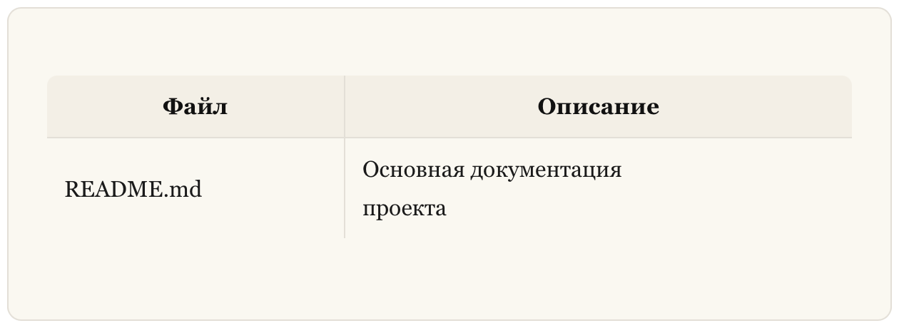
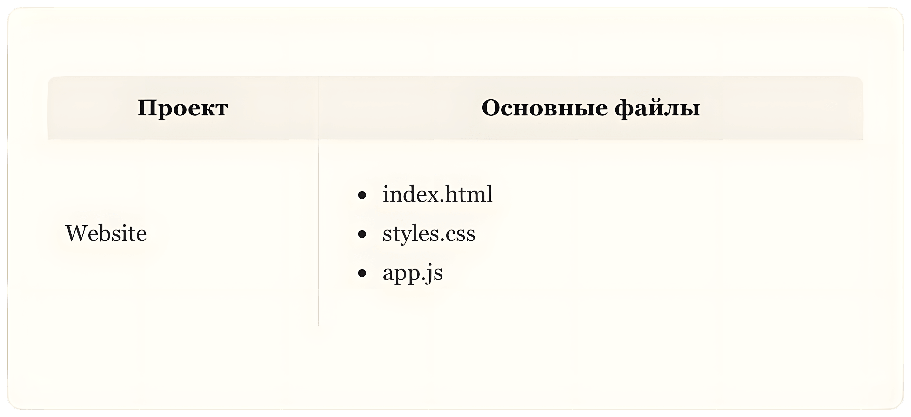

## Таблицы

В **Markdown** таблицы (**Tables**) позволяют удобно представлять структурированные данные. Они часто используются для оформления документации, описания параметров, сравнения характеристик и отображения различной технической информации.

### Создание таблицы

Для создания таблицы в **Markdown** используются вертикальные черты `|`, которые разделяют столбцы, и тире `-`, обозначающие строку заголовков.

**Пример (Markdown):**

```markdown
| Язык         | Расширение | Основное назначение        |
|--------------|------------|----------------------------|
| Python       | .py        | Разработка приложений      |
| JavaScript   | .js        | Веб-разработка             |
| HTML         | .html      | Разметка веб-страниц       |
| CSS          | .css       | Оформление веб-страниц     |

```

**Результат (HTML):**

```html
<table>
  <thead>
    <tr>
      <th>Язык</th>
      <th>Расширение</th>
      <th>Основное назначение</th>
    </tr>
  </thead>
  <tbody>
    <tr>
      <td>Python</td>
      <td>.py</td>
      <td>Разработка приложений</td>
    </tr>
    <tr>
      <td>JavaScript</td>
      <td>.js</td>
      <td>Веб-разработка</td>
    </tr>
    <tr>
      <td>HTML</td>
      <td>.html</td>
      <td>Разметка веб-страниц</td>
    </tr>
    <tr>
      <td>CSS</td>
      <td>.css</td>
      <td>Оформление веб-страниц</td>
    </tr>
  </tbody>
</table>
```

**Результат (Отображение):**



### Выравнивание текста в таблице

**Markdown** позволяет управлять выравниванием содержимого столбцов с помощью двоеточий `:`.

**Используются следующие варианты:**

-   `:------` — выравнивание по левому краю.
-   `:-----:` — выравнивание по центру.
-   `------:` — выравнивание по правому краю.

**Пример (Markdown):**

```markdown
| Технология   | Категория      | Год выпуска |
|:-------------|:--------------:|------------:|
| HTML         | Разметка       | 1993        |
| CSS          | Стили          | 1996        |
| JavaScript   | Программирование | 1995      |
| Markdown     | Документация   | 2004        |
```

**Результат (HTML):**

```html
<table>
  <thead>
    <tr>
      <th style="text-align: left;">Технология</th>
      <th style="text-align: center;">Категория</th>
      <th style="text-align: right;">Год выпуска</th>
    </tr>
  </thead>
  <tbody>
    <tr>
      <td style="text-align: left;">HTML</td>
      <td style="text-align: center;">Разметка</td>
      <td style="text-align: right;">1993</td>
    </tr>
    <tr>
      <td style="text-align: left;">CSS</td>
      <td style="text-align: center;">Стили</td>
      <td style="text-align: right;">1996</td>
    </tr>
    <tr>
      <td style="text-align: left;">JavaScript</td>
      <td style="text-align: center;">Программирование</td>
      <td style="text-align: right;">1995</td>
    </tr>
    <tr>
      <td style="text-align: left;">Markdown</td>
      <td style="text-align: center;">Документация</td>
      <td style="text-align: right;">2004</td>
    </tr>
  </tbody>
</table>
```

**Результат (Отображение):**



### Форматирование текста в таблицах

В **Markdown** внутри ячеек таблиц можно использовать большинство встроенных элементов форматирования. Например, поддерживаются **жирный** и _курсивный_ текст, встроенный код (текст в обратных кавычках `` ` ``) и ссылки. При этом блоки кода и некоторые другие элементы внутри таблиц не поддерживаются.

**Пример (Markdown):**

```markdown
| **Технология** | **Файл**      | **Назначение**            |
|----------------|---------------|---------------------------|
| *Markdown*     | `README.md`   | Документация проекта      |
| *HTML*         | `index.html`  | Главная веб-страница      |
| *CSS*          | `styles.css`  | Стилизация интерфейса     |
| *JavaScript*   | `app.js`      | Логика приложения         |
```

**Результат (HTML):**

```html
<table>
  <thead>
    <tr>
      <th><strong>Технология</strong></th>
      <th><strong>Файл</strong></th>
      <th><strong>Назначение</strong></th>
    </tr>
  </thead>
  <tbody>
    <tr>
      <td><em>Markdown</em></td>
      <td><code>README.md</code></td>
      <td>Документация проекта</td>
    </tr>
    <tr>
      <td><em>HTML</em></td>
      <td><code>index.html</code></td>
      <td>Главная веб-страница</td>
    </tr>
    <tr>
      <td><em>CSS</em></td>
      <td><code>styles.css</code></td>
      <td>Стилизация интерфейса</td>
    </tr>
    <tr>
      <td><em>JavaScript</em></td>
      <td><code>app.js</code></td>
      <td>Логика приложения</td>
    </tr>
  </tbody>
</table>

```

**Результат (Отображение):**



### Ограничения таблиц Markdown

1.  Внутри таблиц нельзя использовать заголовки Markdown.
    
2.  Не поддерживаются блоки цитат, списки Markdown и горизонтальные линии.
    
3.  Поддержка HTML внутри таблиц зависит от используемого Markdown-процессора.
    

### Экранирование символов в таблицах

Если внутри ячейки необходимо вывести символ вертикальной черты `|`, который используется как разделитель столбцов, его следует экранировать. Для этого можно использовать HTML-сущность `&#124;` или обратный слэш `\`.

**Пример (Markdown):**

```markdown
| Команда                | Описание                          |
|------------------------|-----------------------------------|
| grep &#124; sort       | Использование HTML-сущности       |
| grep \| sort           | Использование обратного слэша     |
```

**Результат (Отображение):**



### Переносы строк в ячейках таблицы

Если ваш Markdown-процессор поддерживает HTML, для переноса строки внутри ячейки можно использовать тег `<br>`.

**Пример (Markdown):**

```markdown
| Файл        | Описание                                 |
|-------------|------------------------------------------|
| README.md   | Основная документация<br>проекта         |
```

**Результат (Отображение):**



### Списки в ячейках таблицы

Если Markdown-процессор поддерживает HTML, внутри ячейки можно использовать HTML-списки.

**Пример (Markdown):**

```markdown
| Проект  | Основные файлы                                                 |
|---------|----------------------------------------------------------------|
| Website | <ul><li>index.html</li><li>styles.css</li><li>app.js</li></ul> |
```

**Результат (Отображение):**

