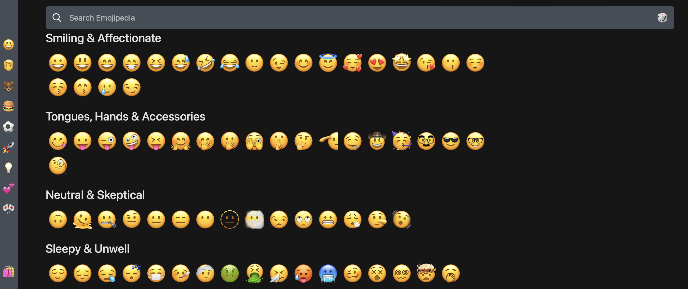
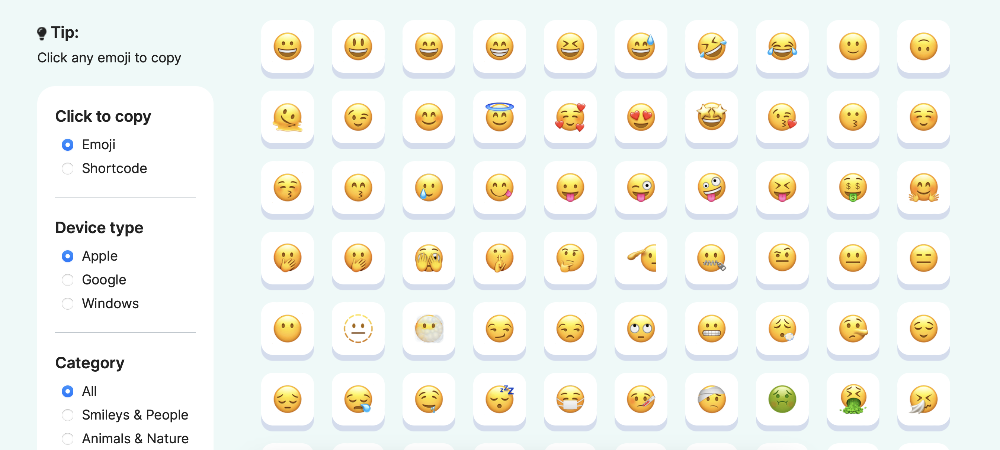
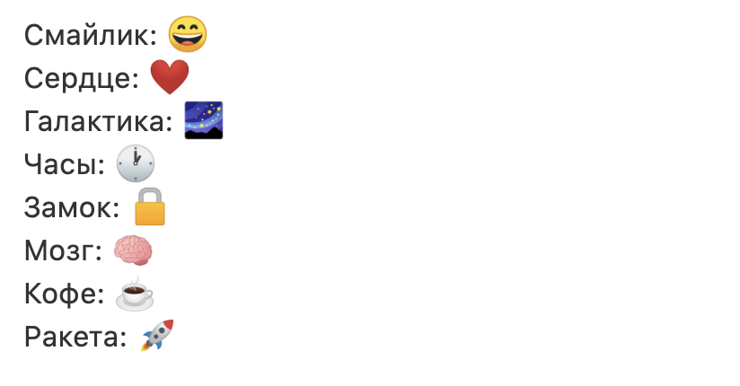

## Эмодзи

**Эмодзи (Emoji)** — это забавные и выразительные иконки, которые можно добавлять к тексту, чтобы придать ему эмоциональный оттенок. В **Markdown** есть два способа добавления эмодзи: копирование и вставка изображения эмодзи или использование кодов эмодзи.

### Копирование и Вставка Эмодзи

В большинстве случаев вы можете просто скопировать эмодзи с ресурса, такого как [Emojipedia](https://emojipedia.org), и вставить его в свой документ.



Многие приложения **Markdown** автоматически отобразят эмодзи в форматированном тексте **Markdown**. 

Если вы используете генератор статических сайтов, убедитесь, что вы кодируете **HTML**\-страницы в формат **UTF-8**.

### Использование Кодов Эмодзи

Некоторые приложения **Markdown** позволяют вам вставлять эмодзи, вводя их коды. Эти коды начинаются и заканчиваются двоеточием и включают название эмодзи.

Вы можете использовать этот [список кодов эмодзи](https://www.webfx.com/tools/emoji-cheat-sheet/), но помните, что коды эмодзи могут различаться от приложения к приложению.



Обратитесь к документации вашего приложения **Markdown** для получения дополнительной информации.

**Пример (Markdown):** 

```markdown
Смайлик: :smile:
Сердце: :heart:
Галактика: :milky_way:
Часы: :clock1:
Замок: :lock:
Мозг: :brain:
Кофе: :coffee:
Ракета: :rocket:
```

**Результат (Отображение):**

