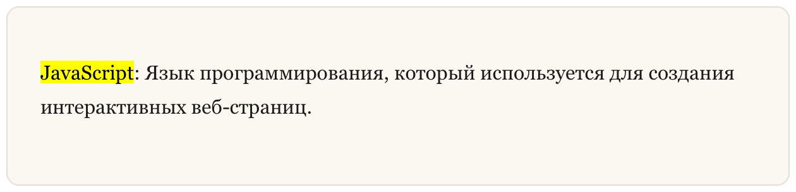

## Маркер

**Маркер (Highlight)** в **Markdown** — это удобный способ выделить важный фрагмент текста. Его можно использовать, чтобы обратить внимание на ключевые термины, команды или части кода в документации.

### Синтаксис маркера

Чтобы выделить текст, используются два знака равенства `==` перед и после слова или фразы.

**Пример (Markdown):** 

```markdown
==JavaScript==: Язык программирования, который используется для создания интерактивных веб-страниц.
```

**Результат (HTML):** 

```html
<mark>JavaScript</mark>: Язык программирования, который используется для создания интерактивных веб-страниц.
```

**Результат (Отображение):**



### Где используется маркер

Маркер полезен в технической документации, учебных материалах и заметках разработчика. С его помощью можно выделять:

-   важные термины;
-   названия технологий;
-   ключевые команды;
-   важные части инструкции.

**Пример (Markdown):**

```markdown
Для установки пакетов используется команда ==npm install==.
```

**Результат (HTML):**

```html
Для установки пакетов используется команда <mark>npm install</mark>.
```

**Результат (Отображение):**

