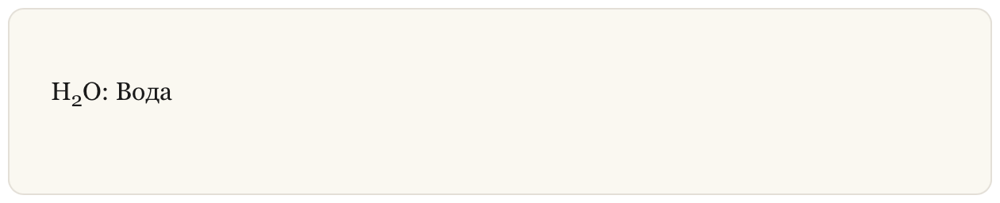

## Нижний индекс

**Нижний индекс (**Subscript**)** в **Markdown** — это нечасто используемая, но иногда полезная функция, которая позволяет понизить позицию одного или нескольких символов ниже обычной линии текста. 

### Синтаксис Нижнего Индекса

**Пример (Markdown):** 

```markdown
H~2~O: Вода
```

**Результат (HTML):** 

```html
H<sub>2</sub>O: Вода
```

**Результат (Отображение):**

