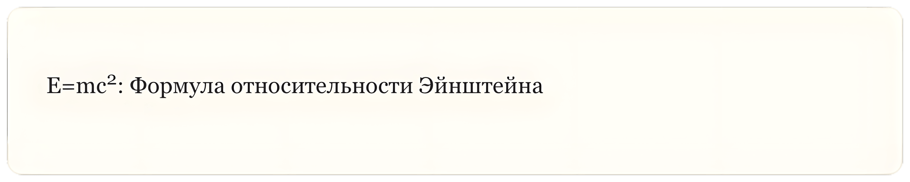

## Верхний индекс

**Верхний индекс (Superscript****)** в **Markdown** — это нечасто используемая, но иногда полезная функция, которая позволяет поднимать один или несколько символов выше обычной линии текста.

### Синтаксис Верхнего Индекса

**Пример (Markdown):** 

```markdown
E=mc^2^: Формула относительности Эйнштейна
```

**Результат (HTML):** 

```html
E=mc<sup>2</sup>: Формула относительности Эйнштейна
```

**Результат (Отображение):**

